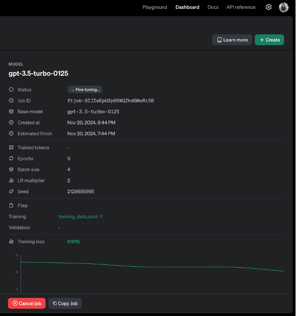
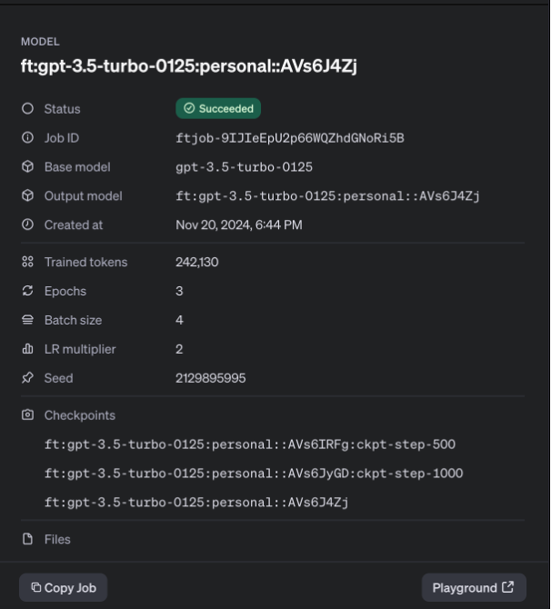
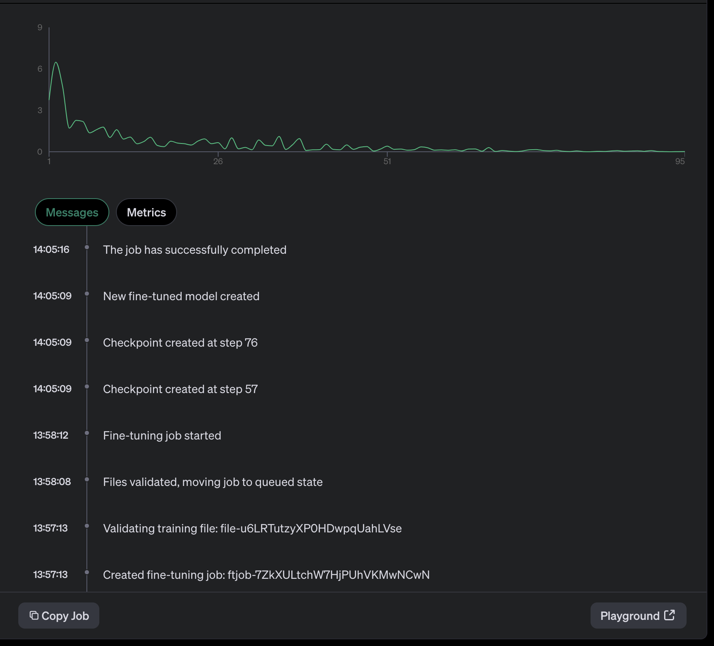

## Project: Advanced-Fine-Tuning-Drug-Classification

# Drug-to-Malady Prediction Model

This project fine-tunes an AI model to predict maladies based on drug names using a dataset of 2000 drug examples. The implementation involves converting data from an Excel file to JSONL format, training a fine-tuned model, and testing its predictions.

---

## Overview

This project utilizes OpenAI's API for fine-tuning a model that can predict a malady based on a drug's name. The dataset includes 2000 examples, and the fine-tuned model maps each drug name to its corresponding malady. The fine-tuned model can be tested using a simple Python script.

---

## Features

- Convert data from Excel to JSONL format for fine-tuning.
- Train a model using OpenAI's API with custom dataset.
- Predict maladies based on drug names.
- Easy testing of the model with predefined or custom inputs.

---

## Setup and Installation

1. Clone the repository:
   ```bash
   git clone https://github.com/YinYinPhyo/Advanced-Fine-Tuning-Drug-Classification.git

2. Install dependencies:

    ```bash
    pip install -r requirements.txt
    ```

3. Set up environment variables:

    Create a .env file in the root directory and add the following:
    ```bash
    OPENAI_API_KEY=<your_openai_api_key>
    ```

## Sample Output

### Processing Fine Tuning


### Succeeded Fine Tuning


